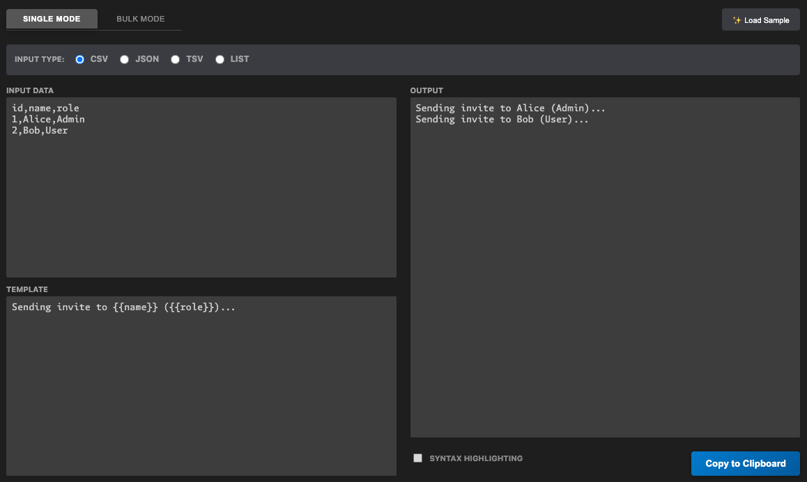
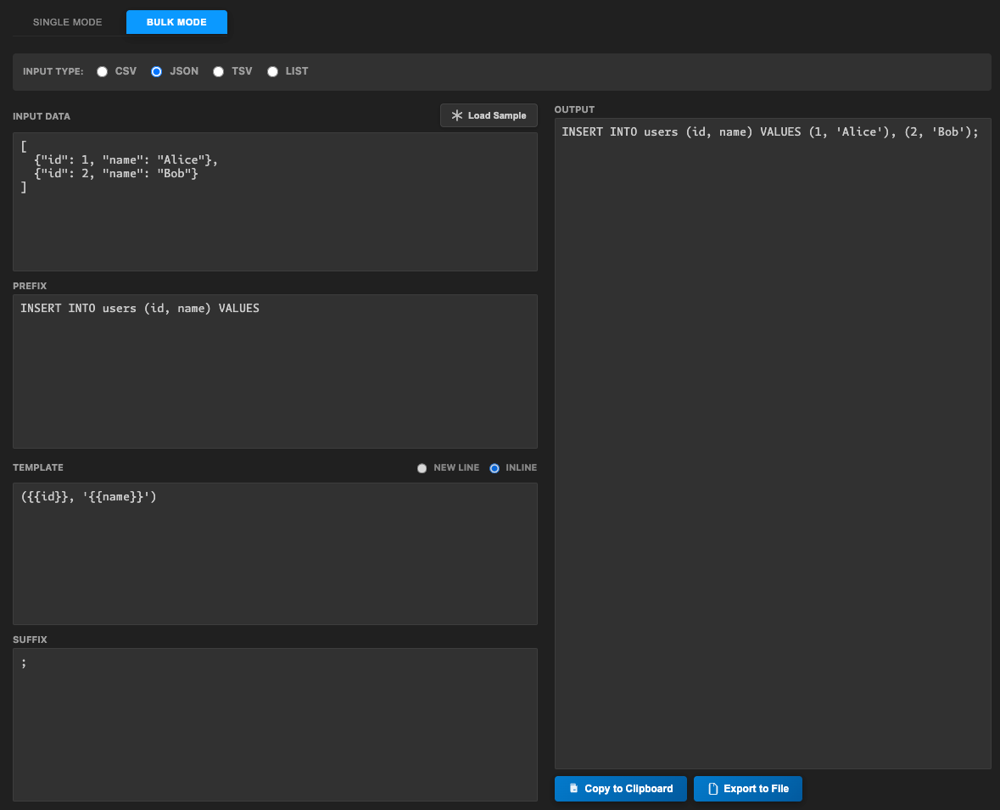

# Bulk Ops Generator

Bulk Ops Generator takes CSV, JSON, TSV, XML, or List data and transforms it into bulk commands (like SQL, cURL, etc.) using customizable templates.

| Preview |
| :---: |
| **Single Mode** |
|  |
| **Bulk Mode** |
|  |

## Features

### 🚀 Dual Modes
- **Single Mode**: Process data row-by-row. Perfect for generating a list of individual API calls (cURL) or independent commands.
- **Bulk Mode**: Aggregate all your data into a single block. Ideal for SQL `INSERT` statements with multiple `VALUES`, or comma-separated lists.

### 📄 Flexible Input Types
- **CSV**
- **JSON**
- **TSV**
- **XML**
- **List**: Support custom separator (comma, pipe, new line, etc.)

### 🎨 Editing Experience
- **Real-time Preview**: See your output instantly as you type.
- **Join Type**: Choose between "New Line" or "Inline" for your bulk operations.
- **Smart Templates**: Use auto-completion, conditional logic, loops, and custom helpers in your templates. [Learn more in the Smart Template Guide](docs/smart-template.md).
- **Sample Data**: One-click sample loader to help you get started with any input type.
- **Save & Load Templates**: Save your frequently used templates to a file and load them later with a single click.

## Configuration

You can customize the path where your templates are stored by setting the `bulk-ops-generator.templateFilePath` in your VS Code settings.

- **Type**: `string`
- **Default**: `~/bulk-ops-templates.json`

The path can be absolute or relative to your workspace root. This is useful for sharing templates with your team by checking the file into version control.

## How to Use

1.  Open the Command Palette (`Cmd+Shift+P` or `Ctrl+Shift+P`).
2.  Run `Bulk Ops Generator: Open`.
3.  **Input**: Select your input type (CSV, JSON, etc.) and paste your data.
4.  **Configure**:
    - Switch to **Single** or **Bulk** mode.
    - Write your **Template** using `{{key}}` syntax.
    - In Bulk mode, set a **Prefix** (start of block) and **Suffix** (end of block).
5.  **Output**: Copy the generated code to your clipboard!

---

**Enjoying the extension?** Please leave a review!

---

Built with ❤️ and 🤖 AI
